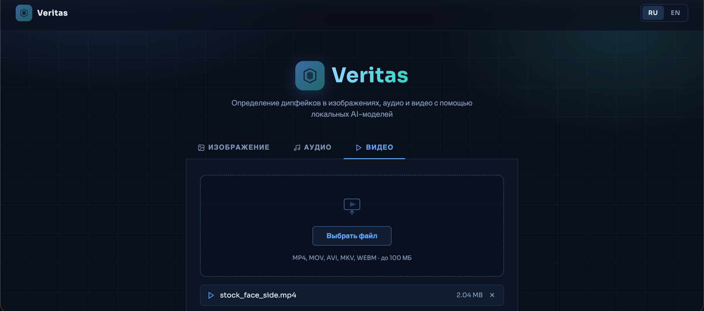
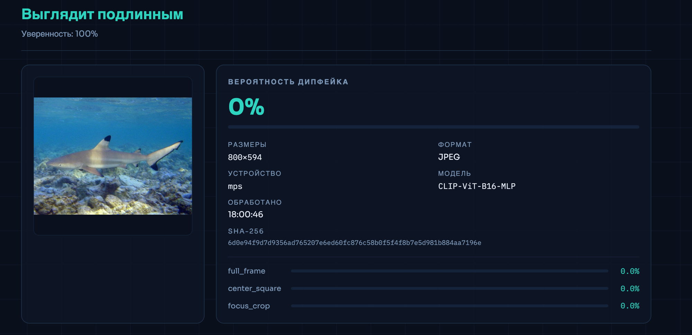
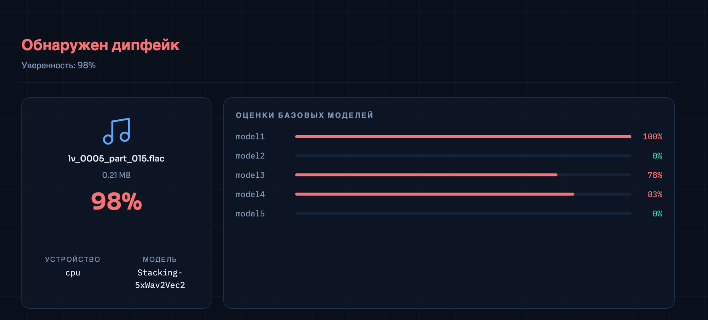
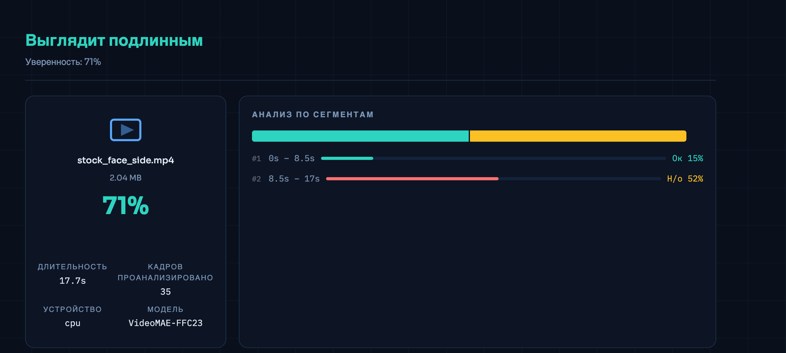

# Veritas — Deepfake Detection Service

Мультимодальный веб-сервис для обнаружения дипфейков в **изображениях**, **аудио** и **видео**. Весь анализ выполняется локально — файлы не покидают устройство пользователя.



---

## Возможности

- **3 модальности** — единый интерфейс для проверки изображений, аудио и видео
- **Приватность** — файлы не отправляются на внешние серверы, ML-инференс локальный
- **Ансамблевые модели** — стекинг 5 моделей (аудио), multi-view анализ (изображения), temporal transformer (видео)
- **Сегментный анализ видео** — разбивка на временные отрезки с независимой оценкой каждого
- **Двуязычный интерфейс** — русский / английский
- **Асинхронный бэкенд** — неблокирующий FastAPI с thread pool executors

---

## Скриншоты

| Анализ изображения | Анализ аудио | Анализ видео |
|-|-|-|
|  |  |  |

---

## Архитектура

```
                      ┌─────────────────────┐
                      │   Vue 3 + TypeScript │
                      │   Frontend (Vite)    │
                      └─────────┬───────────┘
                                │ REST API
                      ┌─────────▼───────────┐
                      │   FastAPI Backend    │
                      │  async + ThreadPool  │
                      └─────────┬───────────┘
                ┌───────────────┼───────────────┐
                ▼               ▼               ▼
        ┌──────────────┐ ┌──────────────┐ ┌──────────────┐
        │    Image     │ │    Audio     │ │    Video     │
        │  Detector    │ │  Detector    │ │  Detector    │
        │              │ │              │ │              │
        │ CLIP ViT-B/16│ │ 5x Wav2Vec2 │ │  VideoMAE    │
        │  + MLP Head  │ │ + Stacking   │ │  (FF++ C23)  │
        │              │ │  LogRegress  │ │ + MediaPipe  │
        └──────────────┘ └──────────────┘ └──────────────┘
```

---

## Модели и результаты

### Image Detector

| | |
|-|-|
| **Backbone** | CLIP ViT-B/16 (OpenAI, 150M params) |
| **Head** | MLP 512 → 256 → 1 (132K params) |
| **Подход** | Multi-view: full frame + center crop + focus crop, усреднение |
| **Датасет** | AI-generated vs real images |
| **Accuracy** | ~94% на валидации |

Модель извлекает CLIP-эмбеддинги из трёх кропов изображения и усредняет вероятности. Это позволяет ловить артефакты как в центре кадра, так и по краям.

### Audio Detector

| | |
|-|-|
| **Base models** | 5 fine-tuned Wav2Vec2 моделей (HuggingFace) |
| **Meta-learner** | Logistic Regression (scikit-learn) |
| **Подход** | Stacking ensemble — выходы 5 моделей → мета-классификатор |
| **Датасет** | garystafford/deepfake-audio-detection (ElevenLabs, Kokoro, Polly, Hume) |
| **Accuracy** | **98.2%** на валидации |

Калиброванные пороги: FAKE >= 0.70, REAL <= 0.35, промежуточные значения — "uncertain".

### Video Detector

| | |
|-|-|
| **Модель** | VideoMAE (86M params) |
| **Обучение** | FaceForensics++ C23 (face-swap deepfakes) |
| **Подход** | Извлечение кадров (ffmpeg, 2fps) → face crop (MediaPipe) → 16-frame chunks → VideoMAE |
| **Сегментный анализ** | Видео разбивается на отрезки по 16 кадров, каждый оценивается независимо |
| **Accuracy** | ~93% на FaceForensics++ тестовой выборке |

Для каждого сегмента видео отображается временная шкала с цветовой индикацией (зелёный — подлинное, красный — дипфейк, жёлтый — неоднозначно).

---

## Стек технологий

| Слой | Технологии |
|------|-----------|
| **Frontend** | Vue 3, TypeScript, Vite |
| **Backend** | FastAPI, uvicorn, asyncio, ThreadPoolExecutor |
| **AI/ML** | PyTorch, HuggingFace Transformers, open-clip-torch, scikit-learn, MediaPipe |
| **Утилиты** | ffmpeg, Pillow |

---

## Быстрый старт

### 1. Backend

```bash
# Создать виртуальное окружение
python3 -m venv .venv
source .venv/bin/activate

# Установить зависимости
pip install -r requirements.txt

# Запустить сервер
uvicorn backend.app:app --reload --host 0.0.0.0 --port 8000
```

### 2. Frontend

```bash
cd frontend
npm install
npm run dev
```

Открыть **http://localhost:5173** в браузере.

---

## Структура проекта

```
veritas/
├── ai/
│   ├── image_detector/        # CLIP ViT-B/16 + MLP
│   │   ├── checkpoints/       # Обученные веса
│   │   ├── inference.py       # Инференс pipeline
│   │   ├── model.py           # Архитектура MLP head
│   │   └── train.py           # Скрипт обучения
│   ├── audio_detector/        # 5x Wav2Vec2 + Stacking
│   │   ├── checkpoints/       # Scaler + LogReg + metadata
│   │   └── inference.py       # Инференс pipeline
│   └── video_detector/        # VideoMAE + MediaPipe
│       └── inference.py       # Инференс pipeline
├── backend/
│   ├── app.py                 # FastAPI endpoints + Pydantic models
│   ├── deepfake_runtime.py    # Image detector service
│   ├── audio_runtime.py       # Audio detector service (+ ffmpeg)
│   └── video_runtime.py       # Video detector service
├── frontend/
│   └── src/
│       ├── App.vue            # Single-file component (RU/EN i18n)
│       └── style.css          # UI стили
├── screenshots/               # Скриншоты для README
├── requirements.txt
└── README.md
```

---

*Veritas — Hackathon "Антидипфейк: Вызов 2026", IT-Планета*
